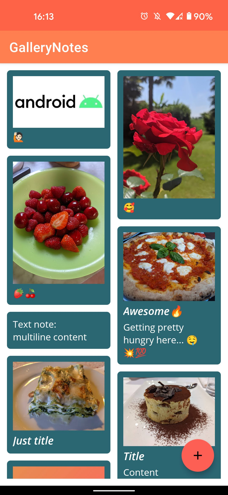

# GalleryNotes
GalleryNotes is an android app that allows user to create text notes and link them with photos in the phone gallery.

## Features
- Create, Modify, Delete and Share notes
- Nice, simple and consistent UI
- Fast and responsive user interaction

## Screenshots

## App design schema

----------- 
_App testata su Google Pixel 5, Android 11_

*Embedded System Programming 2020/21, Unipd, 6 cfu exam.*
